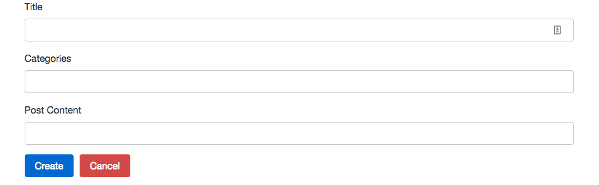

# Redux Blog

A vanilla blog application with [Redux Form](https://redux-form.com/) and [React Router](https://reacttraining.com/react-router/). Styling can be improved, but the goal is to implement the core actions needed for form validation, navigation, and CRUD operations.

  

### Prerequisites

You'll need [Yarn](https://yarnpkg.com/en/) or [npm](https://www.npmjs.com/) installed.

### Installing

Run:

```
yarn install
```

or

```
npm install
```

### Running the Project

The application uses the [Redux Blog Post API](https://reduxblog.herokuapp.com/) to persist data. Inside of `actions/index.js` you can change the value of `USERNAME` if you want your own unique data.

The project runs locally on port `8080`. To fire up
the application, run:

```
npm start
```

or

```
yarn start
```
